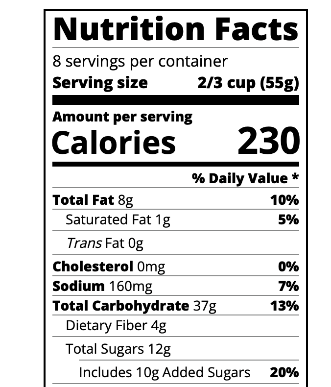

# Building a Nutrition Label using Typography
 My project using Typography: https://jcizidrosilva.github.io/Building-a-Nutrition-Label-using-Typography/
 
 In this project I could notice that when we are using html and css there is the right way of doing things. Once you use the right attributes, later on you can avoid some kinds of "headeaches"
 
 
